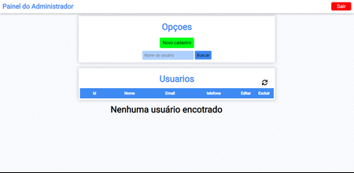

# Sistema de upload de imagens
Sistema dinâmico de cadastro de usuário utilzando php e javascript.


## 🚀 Começando

Essas instruções permitirão que você consiga rodar o projeto na sua máquina ou num servidor web.

Consulte **Instalação** para saber como implantar o projeto.

### 📋 Pré-requisitos

Ter um servidor **PHP** (apache) instalado Xampp ou Wampserver no **Windows** ou Lamp no **Linux** com **PHP** 7.3.2 ou superior e um banco de dados **Mysql**.

```
Servidor Local 
Windows: Xampp ou Wampserver.
Linux: Lamp.
```

### 🔧 Instalação (local)

Importa as tabelas do banco de dados **cadastrousuarios.sql** para o Mysql.

Defina as credenciais de acesso ao banco de dados.
<br>
No arquivo functions/**connect.php**

```
    define('HOST', 'localhost');
    define('USER', 'root');
    define('PASSWORD', '');
    define('DBNAME', 'cadastrousuarios');
    
    const BASE = "http://localhost/cadastrousuarios/";
```

Altere a constante **const** para a url onde seu projeto está instalado.

```
    const BASE = "http://seudominio.com/cadastrousuarios/";
```

```
    $GLOBALS['URL_PROJECT'] = "http://seudominio.com/nomedapastadoprojeto/";
```

Pronto agora e só acessar a url do sistema e começar a usar.

## 📦 Desenvolvimento

Sistema desenvolvido com PHP e JavaScript/ajax , Sistema dinâmico de cadastro de usuarios **(não necessario reflesh na página para cadastrar, editar ou excluir usuários cadastrados).**

- HTML5
- CSS3
- PHP 7
- JAVASCRIPT/JQUERY 
- AJAX

## 🎁 Detalhes

Sistem feito com o intuito de demonstrar conhecimentos no lado backend **PHP**, **AJAX/JavaScript** e **MYSQL** e Manipulações de elementos na tela **frontend** utlizando **JAVASCRIPT**, **JQUERY** e **CSS**.

---

⌨️ Feito por [Bruno Lopes Silva](https://github.com/brunosilvabrn) 